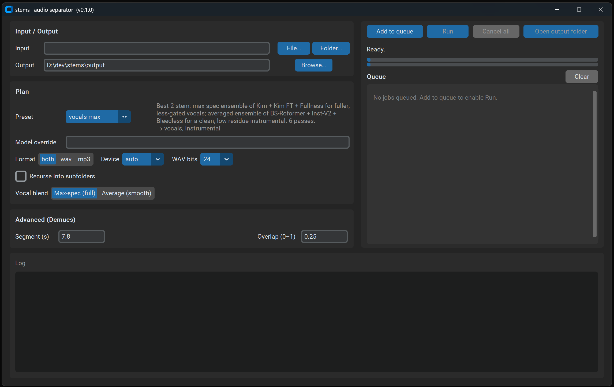

# stems

**Professional CLI audio stem separator.** Splits MP3/WAV (and most common audio
formats) into stems at studio quality, using a multi-backend engine:

- **Demucs v4** (Meta) - best all-round 4-stem and 6-stem separation.
- **`audio-separator`** - the Ultimate Vocal Remover (UVR) model zoo: **BS-Roformer**,
  **Mel-Band Roformer**, **MDX23C**, MDX-Net, VR-Arch - best-in-class
  vocals/instrumental isolation.

Output is lossless **24-bit WAV** plus a **320 kbps MP3** copy of every stem.
Single files and whole folders (recursive) are supported, with skip-existing for
resumable batches.

**Input formats:** WAV, MP3, FLAC, OGG/Opus, M4A/AAC, WMA, AIFF, and WebM/MP4/MKV
(audio track) - anything libsndfile or ffmpeg can decode. Output sample rate
follows the source (e.g. a 48 kHz WebM yields 48 kHz stems).



---

## Capabilities

| Preset | Output stems | Strategy |
|--------|--------------|----------|
| `vocals` | vocals, instrumental | BS-Roformer ep368 (single fast pass) |
| `vocals-max` *(default)* | vocals, instrumental | **Vocals:** max-spectrogram ensemble of Kim Jensen + Kim FT + Fullness (fuller, less "gated"). **Instrumental:** averaged ensemble of BS-Roformer + Inst-V2 + Bleedless (low vocal residue). 6 passes - the cleanest, most natural 2-stem. |
| `4stem` | vocals, drums, bass, other | Demucs `htdemucs_ft` (single pass) |
| `4stem-max` | vocals, drums, bass, other | Cascade: ensemble instrumental → Demucs `htdemucs_ft` on the clean instrumental (+ ensemble vocals) |
| `6stem` | vocals, drums, bass, guitar, piano, other | Demucs `htdemucs_6s` |
| `6stem-max` | vocals, drums, bass, other, guitar, piano | Cascade: ensemble instrumental → Demucs `htdemucs_6s` for drums/bass/other/piano, with **guitar from a dedicated Roformer guitar model** (+ ensemble vocals). Requires `--guitar-source`. |

- **Ensemble** - runs several models and merges per-stem (waveform average or
  max-spectrogram) for the cleanest possible result.
- **Cascade** (`4stem-max`, `6stem-max`) - builds the cleanest instrumental via the
  dedicated instrumental ensemble, then runs Demucs on *that* (not the raw mix) so
  vocals never bleed into drums/bass/other. Vocals come from the vocal ensemble and
  are only computed when requested - `--stems drums,bass,other` skips the vocal
  passes for speed.
- **Raw model override** - `--model htdemucs_6s` or `--model bs_roformer` bypasses
  presets for full control.

> **On guitar:** `6stem-max` replaces Demucs's weak guitar head with a dedicated
> Mel-Band Roformer guitar model. No single input is best for every song, so you
> must pick one with `--guitar-source`:
> - `instrumental` - vocals removed only (drums/bass kept). Best for **faint /
>   buried / acoustic** guitar; the Demucs pass never gets to mangle it.
> - `no-drums` - vocals + drums + bass removed. Best for **prominent / electric**
>   guitar; kills drum-section bleed (but can drop pure-noise effects like feedback).
> - `mix` - the original mix untouched (leaves some vocal bleed in the guitar).
>
> It's good, not perfect - sparse/percussive passages and pure feedback remain hard.
> `piano` still comes from `htdemucs_6s` and stays weak.

> **Guitar model setup:** the guitar weights aren't in the `audio-separator`
> catalog. Place `becruily_guitar.ckpt` + `config_mel_band_roformer_guitar_becruily.yaml`
> (from [`becruily/mel-band-roformer-guitar`](https://huggingface.co/becruily/mel-band-roformer-guitar))
> in `models/`, and keep the matching entry under `roformer_download_list` in
> `models/download_checks.json` (re-add it if that file is ever wiped). The model
> trains with `mlp_expansion_factor: 1`; `uvr_engine.ensure_roformer_mlp_expansion_patch()`
> handles that at load time, so no dependency edits are needed.

---

## Requirements

- **Python 3.10–3.12** (3.10 recommended for the widest ML wheel compatibility).
- **ffmpeg** on `PATH` (used for decoding arbitrary formats and MP3 export).
- **GPU (optional but recommended):** an NVIDIA CUDA GPU dramatically speeds up
  separation. An 8 GB card (e.g. RTX 3060 Ti) runs every preset here; chunked
  inference keeps memory in check. CPU works but is much slower.

---

## Installation

```powershell
# From the project root (D:\dev\stems)
py -3.10 -m venv .venv
.\.venv\Scripts\Activate.ps1

# 1) Install the CUDA build of PyTorch FIRST (pick the CUDA version for your driver):
pip install torch torchaudio --index-url https://download.pytorch.org/whl/cu124

# 2) Install stems and the rest of the dependencies:
pip install -e .

# 3) GPU runtime for the UVR/Roformer backend (audio-separator imports onnxruntime):
pip install onnxruntime-gpu
```

CPU-only machine? Skip step 1, run `pip install -e .`, and install plain
`onnxruntime` instead of `onnxruntime-gpu` in step 3 (PyTorch CPU build is pulled
in automatically). Model weights download on first use into `./models/` for UVR
models and `~/.cache/torch/hub` for Demucs (override the former with the
`STEMS_MODEL_DIR` environment variable).

---

## Usage

```powershell
# Minimal: vocals + instrumental is the default → ./output/<track>/
stems separate song.mp3

# Same thing, preset stated explicitly
stems separate song.mp3 -p vocals-max

# 4-stem cascade (drums/bass/other) instead
stems separate song.mp3 -p 4stem-max

# 6 stems (vocals, drums, bass, guitar, piano, other)
stems separate song.wav out\ --preset 6stem

# Best 6-stem with a dedicated guitar model - pick the guitar input:
stems separate song.mp3 -p 6stem-max --guitar-source no-drums      # prominent/electric
stems separate song.mp3 -p 6stem-max --guitar-source instrumental  # faint/acoustic

# Cleanest vocals/instrumental via model ensemble (explicit output dir)
stems separate song.mp3 out\ -p vocals-max

# Only keep certain stems (each its own file), WAV only
stems separate song.wav out\ -p 6stem --stems vocals,drums --format wav

# Combine selected stems into ONE summed file → vocals+drums.wav (+ .mp3)
stems separate song.wav out\ -p 6stem --mix vocals,drums

# Batch an entire library recursively, resume-friendly
stems separate .\album\ out\ -r --skip-existing -p 4stem-max

# Use a specific raw model
stems separate song.mp3 out\ --model htdemucs_6s

# Force CPU / tune VRAM
stems separate song.mp3 out\ --device cpu
stems separate song.mp3 out\ --segment 5 --overlap 0.1   # less VRAM
```

Discover what's available:

```powershell
stems presets     # list presets and their output stems
stems models      # list known Demucs + UVR models
stems --help
stems separate --help
```

### Desktop GUI

A desktop GUI (CustomTkinter) is available alongside the CLI - same engine, same
presets, with live progress and a download indicator. Just run the launcher - on
its first run it installs the GUI dependencies itself, so there's nothing to
`pip install` by hand:

```
stems-gui.bat          # from the project folder (double-click or from a terminal)
```

(The first launch shows a console window while it installs the GUI extras; after
that it opens straight to the window with no console. If you prefer to install
manually, `pip install -e .[gui]` then `stems-gui` works too.)

Pick an input file or folder, choose a preset (or a raw model override), set the
output folder/format/device, and click **Run**. The window stays responsive while
separation runs on a background thread; a step bar tracks each model pass (and
animates while weights are downloading), and **Open output folder** reveals the
results.

Extras:

- **Job queue** - **Add to queue** snapshots the current form as a job (each with
  its own settings). **Run** processes the queue top-to-bottom; you can keep
  adding jobs *while it runs* and they're picked up automatically. Each job shows a
  live elapsed timer and status, with **Cancel task** to drop just the running job
  (the queue moves on) or **Cancel all** to stop everything after the current file.
- **Numbered output folders** - every GUI run writes to its own `NN_<track>/`
  folder (`01_song/`, `02_song/`, …), so running the same file again (e.g. with a
  different preset) never overwrites or mixes into a previous result. Numbering
  continues from whatever `NN_<track>` folders already exist, even across sessions.
- **Combine into one file** - tick any of a preset's stems (e.g. *vocals* +
  *drums*) and the run writes a single summed file (`vocals+drums.wav`/`.mp3`)
  instead of separate stems. Shown for the multi-stem presets; the CLI equivalent
  is `--mix`.
- **Drag-and-drop** a file or folder onto the input box; the **Browse** dialogs
  remember the last folder you used (persisted across restarts).
- **Single instance** - launching again brings the existing window to the front.
- No stray console windows: ffmpeg and the backends run windowless inside the GUI.
- Self-installing: `stems-gui.bat` adds the GUI deps on first run; launches are
  windowless thereafter (it runs `pythonw -m stems.gui`).

### CLI options (`stems separate`)

| Option | Default | Description |
|--------|---------|-------------|
| `INPUT` | - | File or folder to process. |
| `OUTPUT_DIR` | `output` | Where stems are written. |
| `-p, --preset` | `vocals-max` | Named plan (`vocals`, `vocals-max`, `4stem`, `4stem-max`, `6stem`, `6stem-max`). |
| `-m, --model` | - | Raw model override; bypasses preset. |
| `-e, --engine` | auto | Engine for `--model`: `demucs` or `uvr`. |
| `--stems` | all | Comma list of stems to keep, each as its own file (e.g. `vocals,drums`). |
| `--mix` | - | Combine the listed stems into **one** summed file (e.g. `vocals,drums` → `vocals+drums.wav`); only the mix is written. Mutually exclusive with `--stems`. |
| `--guitar-source` | - | `6stem-max` only (**required**): guitar-model input - `instrumental`, `no-drums`, or `mix`. |
| `-f, --format` | `both` | `wav`, `mp3`, or `both`. |
| `--bitdepth` | `24` | WAV bit depth: `16`, `24`, or `32`. |
| `--device` | `auto` | `auto`, `cuda`, or `cpu`. |
| `-r, --recursive` | off | Recurse into subfolders for folder input. |
| `--skip-existing` | off | Skip files whose output already exists. |
| `--segment` | `7.8` | Demucs chunk size (s); lower = less VRAM. |
| `--overlap` | `0.25` | Demucs chunk overlap (0–1); higher = better/slower. |

---

## Output layout

If you omit the output directory, it defaults to **`./output`** (relative to where
you run the command), with a subfolder named after the input file:

```
output/                       # default OUTPUT_DIR (override by passing one)
└── <track-name>/             # derived from the input filename
    ├── vocals.wav        vocals.mp3        # default vocals-max → 2 stems
    └── instrumental.wav  instrumental.mp3
```

(A 4-/6-stem preset writes `drums`, `bass`, `other`, etc. into the same layout.)

With `--mix` (or the GUI's **Combine into one file**), the chosen stems are
summed into a single `<a>+<b>.wav`/`.mp3` (e.g. `vocals+drums.wav`) and **only**
that combined file is written - handy for a quick custom submix.

So `stems separate song.mp3 -p vocals-max` writes to `./output/song/vocals.wav`
(+ `.mp3`) and `./output/song/instrumental.wav` (+ `.mp3`).

In batch mode the input folder structure is mirrored under `OUTPUT_DIR`. Stems are
**not** loudness-normalized, so summing all stems of a Demucs run reconstructs
(approximately) the original mix.

---

## Architecture

See [CLAUDE.md](CLAUDE.md) for the full module map and design notes. In short:

```
src/stems/
├── cli.py            # Typer CLI (separate / presets / models)
├── config.py         # device detection, cache paths, quality defaults
├── presets.py        # named plans → engine/model/strategy
├── audio_io.py       # load + 24-bit WAV / 320k MP3 export
├── engines/
│   ├── base.py       # BaseSeparator interface + SeparationResult
│   ├── demucs_engine.py
│   └── uvr_engine.py
├── ensemble.py       # average / max-spectrogram model merging
├── pipeline.py       # single / ensemble / cascade orchestration + export
├── jobs.py           # batch discovery, progress, skip-existing, summary
└── gui/              # optional CustomTkinter desktop front-end (thin, over pipeline)
```

---

## Development

```powershell
pip install -e ".[dev]"
pytest                     # unit tests (no models/GPU needed)
```

The unit tests stub out the heavy backends, so they run fast on CPU without
downloading any model weights.

---

## Troubleshooting

- **`ffmpeg not found`** - install ffmpeg and ensure it's on `PATH`
  (`ffmpeg -version`). Required for non-WAV input and MP3 output.
- **CUDA out of memory** - lower `--segment` (e.g. `5`) and/or `--overlap`, or
  run `--device cpu`.
- **First run is slow** - model weights download once into `./models/`.
- **Wrong stems from `--model`** - pass `--engine demucs|uvr` to disambiguate.

## License

MIT.
